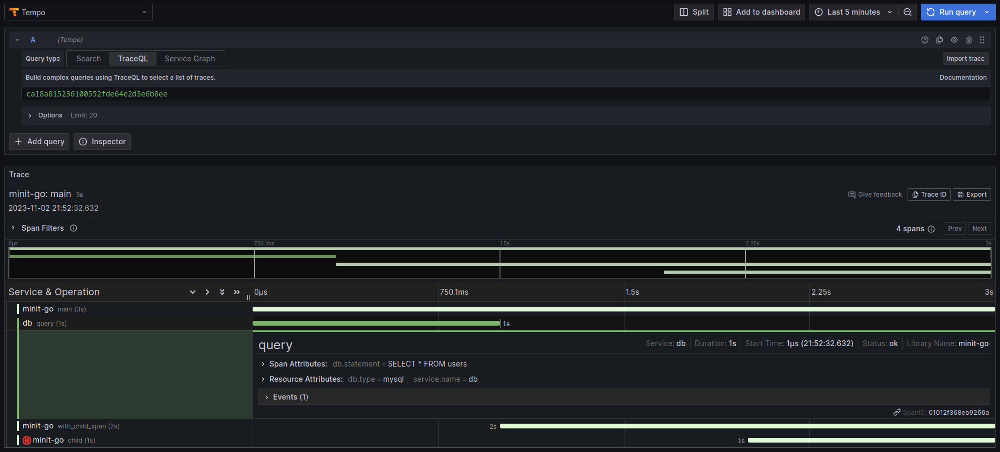

# minit-go

> **NOTE:** You don't want to use this library. You should probably be using [OpenTelemetry](https://opentelemetry.io/).

Minit is a minimal tracing library for Go. When I say minimal, I mean it. 

It's less than 250 lines of code, and, as you can expect, it doesn't have many features. For example, it only supports exporting spans to an OTEL-HTTP-compatible collector, doesn't support sampling, etc. The bits/helpers required to inject and extract trace context in different protocols aren't implemented, either. 

Truth to be said: Because it's so tiny, it's easy to understand and modify. It's also easy to use in simple, non-distributed applications.

## Installation

```go
go get github.com/dgzlopes/minit-go
```

## Usage

This is the code:
```go
package main

import (
	"context"
	"time"

	"github.com/dgzlopes/minit"
)

type App struct {
	tracing *minit.TracingClient
}

func main() {
	tracing := minit.NewTracingClient("http://localhost:4318/v1/traces")

	app := App{
		tracing: tracing,
	}

	trace := tracing.StartTrace()
	root := trace.StartSpan("main")

	// Basic
	app.RunCallToDB(trace)

	// With context
	traced_ctx := trace.InjectInContext(context.Background())
	app.WithChildSpanAndFailure(traced_ctx)

	root.Finish()

	err := tracing.Export()
	if err != nil {
		panic(err)
	}
}

func NewDBSpan(trace *minit.Trace, operation string) *minit.Span {
	span := trace.StartSpan(operation)
	span.Service.Name = "db"
	span.Service.Attributes = map[string]string{
		"db.type": "mysql",
	}
	return span
}

func (_ *App) RunCallToDB(trace *minit.Trace) {
	span := NewDBSpan(trace, "query")
	span.Attributes["db.statement"] = "SELECT * FROM users"
	defer span.Finish()

	time.Sleep(1 * time.Second)

	span.Events = append(span.Events, minit.Event{
		Timestamp: time.Now(),
		Fields: map[string]string{
			"event": "query_finished",
		},
	})
}

func (a *App) WithChildSpanAndFailure(ctx context.Context) {
	span, ctx := a.tracing.StartSpanFromCtx(ctx, "with_child_span")
	defer span.Finish()

	time.Sleep(1 * time.Second)

	child, _ := a.tracing.StartSpanFromCtx(ctx, "child")
	defer child.Finish()

	time.Sleep(1 * time.Second)

    child.MarkAsFailed()
	child.Events = append(span.Events, minit.Event{
		Timestamp: time.Now(),
		Fields: map[string]string{
			"level":   "error",
			"message": "something went wrong",
		},
	})
}
```

This is the trace it would export:

